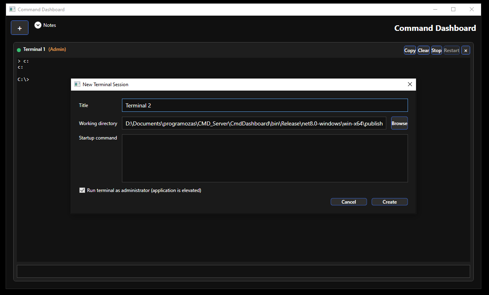
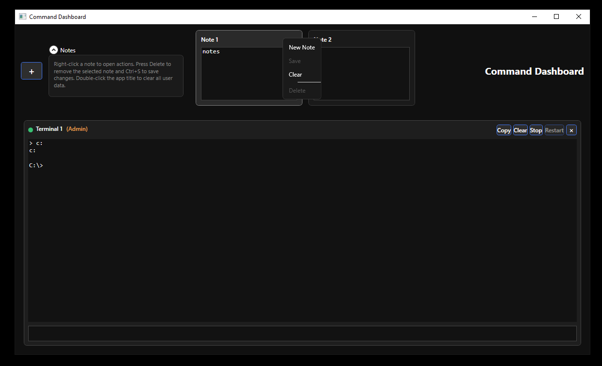
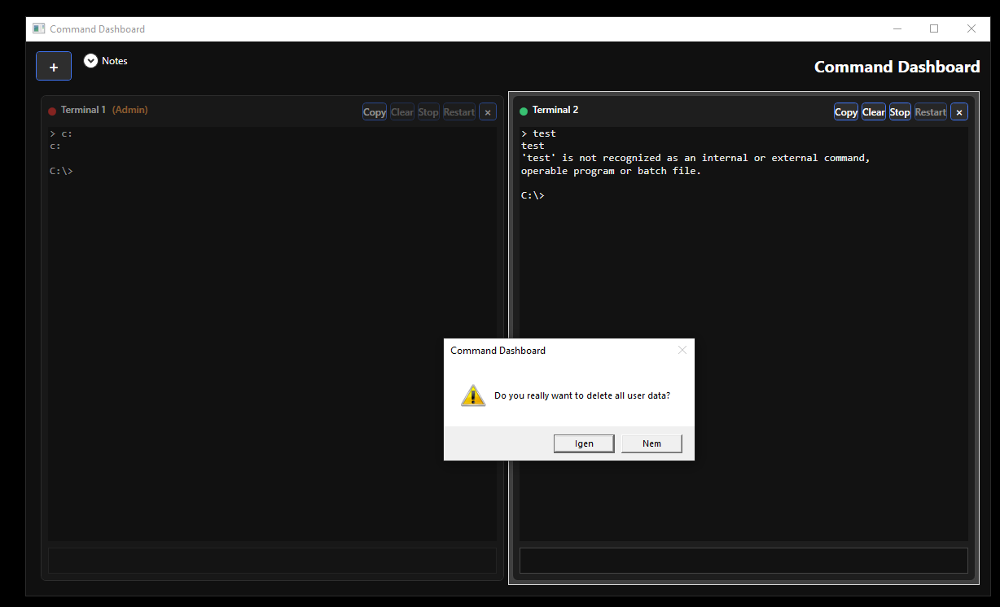
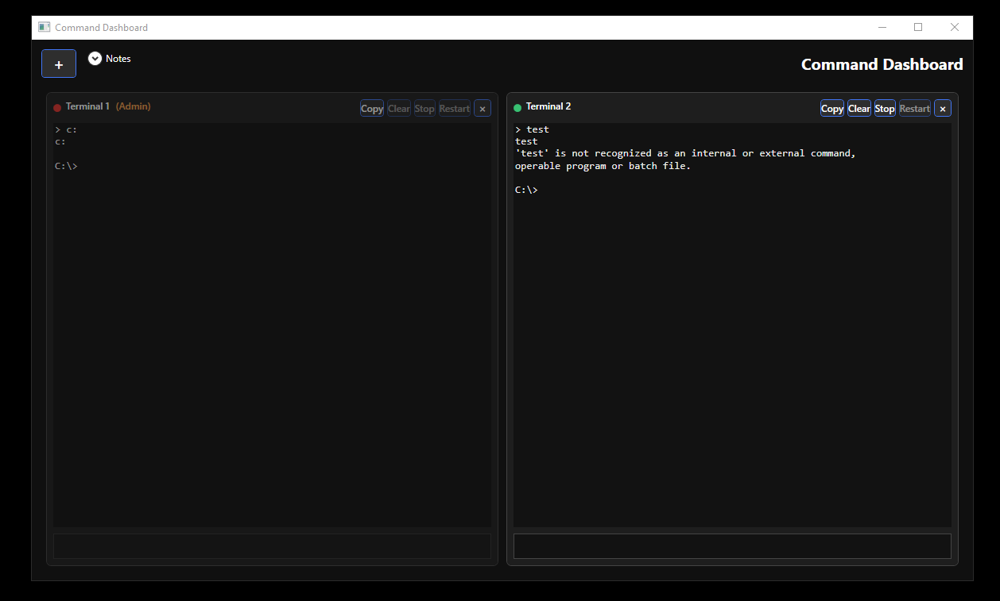

# Command Dashboard

Command Dashboard is a Windows desktop companion for power users who live in the terminal. Launch multiple command prompts, tile them automatically, capture command snippets, and stay productive without juggling windows.

## ✨ Highlights

- **Adaptive tiling** – Sessions snap into responsive grids (1×1, 1×2, 2×2, 3×3, …) as you add or remove terminals.
- **Per-session history** – Use <kbd>↑</kbd>/<kbd>↓</kbd> inside any terminal tile to walk backwards or forwards through commands you already ran.
- **Persistent notes** – Save frequently used commands in the Notes drawer; everything autosaves to `%APPDATA%\CmdDashboard\Notes` and reloads when the app starts.
- **Elevated terminals** – Run Command Dashboard as administrator to spawn elevated consoles; non-admin launches rehydrate elevated sessions in read-only mode.
- **Clipboard-friendly output** – Copy the full log of any terminal with one click. Clipboard contention is safely handled.
- **Keyboard-first workflow** – Delete notes with <kbd>Delete</kbd>, save with <kbd>Ctrl</kbd>+<kbd>S</kbd>, recall grids instantly.

## 🚀 Getting Started

### Requirements

- Windows 10 or Windows 11
- [.NET SDK 8.0](https://dotnet.microsoft.com/download) (includes the runtime)

### Option 1 — Use a prebuilt release

1. Grab the latest `.zip` from the [Releases](https://github.com/Csanindzsa/CMD-Server-Dashboard/releases) page.
2. Unzip it to any folder you trust (e.g., `C:\Tools\CmdDashboard`).
3. Double-click `CmdDashboard.exe` inside the extracted folder.

> 📝 The archive already contains everything required to run on Windows with the .NET 8 desktop runtime installed. No installer or build step is needed.

### Option 2 — Clone, build, and run

```powershell
git clone https://github.com/Csanindzsa/CMD-Server-Dashboard.git
cd CMD-Server-Dashboard
dotnet build CmdDashboard.sln
dotnet run --project CmdDashboard\CmdDashboard.csproj
```

### Create your own release build

```powershell
dotnet publish CmdDashboard\CmdDashboard.csproj -c Release -r win-x64 --self-contained false
```

The publish output (including `CmdDashboard.exe`) will appear under `CmdDashboard\bin\Release\net8.0-windows\win-x64\publish`.

## 🧭 Usage Guide

1. Click the **+** button to open a new terminal. Layouts rebalance instantly.
2. Type a command, press <kbd>Enter</kbd>, and watch output stream live. Use <kbd>↑</kbd>/<kbd>↓</kbd> to recall previous commands in that session.
3. Expand **Notes** to create or pick a note. Selecting a hidden note will slide the row so it appears first; edit the text, then click **Save** (or press <kbd>Ctrl</kbd>+<kbd>S</kbd>). Right-click for quick actions.
4. Drag terminal tiles to reorder them. Use the inline buttons to **Copy**, **Clear**, **Stop**, or close each session.



## ⌨️ Keyboard Shortcuts

- <kbd>Enter</kbd> – Send the pending command to the focused terminal.
- <kbd>↑</kbd>/<kbd>↓</kbd> – Navigate backwards/forwards through the focused terminal’s command history.
- <kbd>Delete</kbd> – Remove the currently selected note (unless it’s protected).
- <kbd>Ctrl</kbd>+<kbd>S</kbd> – Save the contents of the selected note.

## 📁 Notes Storage

Notes are stored as plain-text files under `%APPDATA%\CmdDashboard\Notes`. Drop new `.txt` files in that folder to preload content, or back up the directory to keep your snippets safe.



## 🧰 Managing data and permissions

- **Clear everything:** Use the in-app “Delete all user data” action to wipe notes and saved terminals.
- **Running without admin rights:** Non-admin launches still restore elevated sessions but mark them as read-only.





## 🛠️ Troubleshooting

- **Encoding issues:** The app automatically matches your system’s OEM code page and falls back to UTF-8 when needed.
- **Clipboard busy:** Copying terminal output shows a friendly warning if another app locks the clipboard.
- **Read-only terminals:** Elevated sessions restored while running non-admin will be marked read-only; relaunch the app as administrator to interact with them again.

## 📄 License

This project is released under the [MIT License](LICENSE). Feel free to fork, adapt, and build upon it.